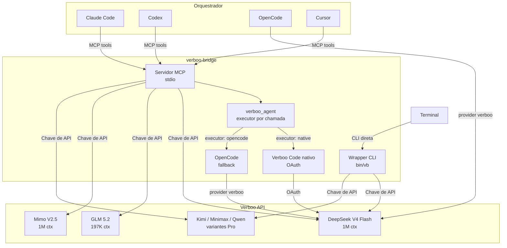

<p align="center">
  
  =18">
  <a href="https://www.npmjs.com/package/verboo-bridge"></a>
  
  
</p>

<div align="center">
  <a href="https://github.com/verbeux-ai">
    
  </a>
  <h1>verboo-bridge</h1>
  <p><strong>Use modelos da Verboo como sub-agentes no Claude Code, Codex, OpenCode, Cursor ou qualquer cliente MCP</strong></p>
  <p>Transforme tokens ilimitados da Verboo em execução distribuída para seu orquestrador preferido</p>
</div>

---

## Arquitetura



---

## Modelos disponíveis

| Modelo | Contexto anunciado | Planos | Seleção automática | Ideal para |
|--------|--------------------|--------|:-------------------:|-----------|
| **DeepSeek V4 Flash** | 1M | Pro, Max e Ultra | Sim | Codificação geral |
| **DeepSeek V4 Pro** | 1M | Max | Não | Codificação mais exigente |
| **Mimo V2.5** | 1M | Pro, Max e Ultra | Sim | Análise com contexto longo |
| **Mimo V2.5 Pro** | 1M | Max | Não | Análise mais exigente |
| **GLM 4.7 Flash** | 201k | Junior, Pro, Max e Ultra | Sim | Tarefas rápidas |
| **Qwen 3.6 27B** | 262k | Junior, Pro, Max e Ultra | Sim | Tarefas leves |
| **GLM 5.2** | 197k | Ultra | Sim | Raciocínio complexo |
| **Kimi K2.7** | 259k | Ultra | Sim | Tarefas gerais e visão |
| **Minimax M3** | até 1M | Max e Ultra | Sim | Codificação rápida e visão |

O roteador não escolhe automaticamente as variantes exclusivas do Max porque a
disponibilidade depende da assinatura. Elas podem ser selecionadas
explicitamente por `model` e limitadas com `VERBOO_NATIVE_MODEL_ALLOWLIST`.
O endpoint `/models` também é filtrado pelo plano associado à chave.

---

## Instalação rápida

O bridge e a CLI nativa do Verboo são pacotes separados. Para usar
`verboo_agent` com o executor recomendado:

```bash
npm install --global @verboo/code
verboo auth login
verboo auth status --text
```

Requisitos:

- Node.js 22+ para o executor nativo com `@verboo/code`;
- Codex, Claude Code, Cursor ou outro cliente MCP;
- OAuth ativo na CLI Verboo — nenhuma API key é necessária no modo nativo.

O bridge pode ser executado diretamente pelo pacote publicado, sem clonar este
repositório: `npx --yes verboo-bridge@latest`. Para desenvolver o bridge
localmente, use:

```bash
git clone https://github.com/nikolasdehor/verboo-bridge.git
cd verboo-bridge
npm install
```

Somente o bridge e as ferramentas de API continuam compatíveis com Node.js 18+.
O fallback por OpenCode requer OpenCode 1.17.9+.

### Variável de ambiente

```bash
export VERBOO_AGENT_ALLOWED_ROOTS="/caminho/para/seus/projetos"
# Padrão opcional; cada chamada pode escolher native ou opencode
export VERBOO_AGENT_EXECUTOR="native"
export VERBOO_CODE_BIN="/caminho/para/verboo"
# Opcional e sensível: habilita edição (sem shell)
export VERBOO_AGENT_WRITE_ENABLED="1"
# Memória técnica persistente e isolada por projeto
export VERBOO_MEMORY_ENABLED="1"
export VERBOO_MEMORY_DIR="$HOME/.local/share/verboo-bridge/memory"
# Índices curados opcionais, somente leitura
export VERBOO_SHARED_MEMORY_FILES="$HOME/.codex/memories/MEMORY.md:$HOME/ObsidianVaults/ClaudeBrain/MEMORY.md"
```

Antes do modo nativo, autentique a CLI oficial uma vez com
`verboo auth login` ou `verboo auth login --headless`. A sessão OAuth é lida
pelo subprocesso via diretório do usuário; a API key não é repassada ao
executor nativo.

`verboo_agent` aceita `executor: "native"` ou `executor: "opencode"` em cada
chamada. A escolha da chamada tem precedência sobre `VERBOO_AGENT_EXECUTOR`.
Sem nenhuma configuração, o padrão é `native`.

Se o comando `verboo` não apontar para a CLI oficial, use Node e o entrypoint:

```bash
export VERBOO_CODE_BIN="/caminho/para/node"
export VERBOO_CODE_ENTRYPOINT="/caminho/para/@verboo/code/dist/cli.mjs"
```

`VERBOO_API_KEY` continua opcionalmente disponível para as ferramentas de prompt
simples (`verboo_code`, `verboo_review` e ferramentas por modelo). Não grave a chave
no repositório.

---

## Configuração por plataforma

Em qualquer cliente, o Verboo aparece como uma ferramenta MCP. Ao chamar
`verboo_agent` ou `verboo_agent_start`, o bridge inicia um subagente externo,
separado e ciente do repositório. Ele não aparece como um subagente nativo da interface.
`read_only` e `write` são apenas modos de permissão dessa execução.

> Em App/IDE ou tarefa não trivial, longa, paralela ou de duração incerta, use
> `verboo_agent_start`, mostre o `job_id`, continue trabalhando e consulte
> `verboo_job` com `status`/`result`. Reserve o `verboo_agent` síncrono para
> tarefas curtas. Se o MCP não aparecer, corrija ou reinicie a integração; não
> substitua a chamada por `verboo -p`, `vb`, `opencode run` ou outro shell.

Antes de configurar, descubra os caminhos absolutos:

```bash
command -v npx
command -v verboo
```

Use esses caminhos nos exemplos abaixo. `$HOME`, `~` e `$(command -v ...)` não
são expandidos dentro de JSON ou TOML.

| Cliente | Configuração | Como validar |
|---|---|---|
| Codex App, CLI e extensão IDE | `~/.codex/config.toml` | App/IDE: `/mcp`; CLI: `codex mcp get verboo-bridge` |
| Claude Desktop | Settings → Developer → Edit Config | Chat: **Connectors**; logs em `~/Library/Logs/Claude` |
| Claude Code | `claude mcp add` ou `.mcp.json` | `claude mcp get verboo-bridge` e `/mcp` |
| Cursor IDE e CLI | `~/.cursor/mcp.json` ou `.cursor/mcp.json` | **Available Tools** ou `cursor-agent mcp list-tools verboo-bridge` |
| OpenCode | `opencode.json` | `opencode mcp list` |

Esses clientes iniciam o servidor local por `stdio`. Apps web ou mobile que
não conseguem executar um processo local exigem o transporte HTTP/stateless
planejado no P2; essa superfície remota ainda não está implementada.

### Codex App, CLI e extensão IDE

O App, a CLI e a extensão compartilham a mesma configuração. Adicione a
`~/.codex/config.toml`:

```toml
[mcp_servers.verboo-bridge]
command = "/caminho/absoluto/para/npx"
args = ["--yes", "verboo-bridge@latest"]
startup_timeout_sec = 60
tool_timeout_sec = 1800
default_tools_approval_mode = "prompt"

[mcp_servers.verboo-bridge.env]
VERBOO_AGENT_ALLOWED_ROOTS = "/caminho/absoluto/para/seus/projetos"
VERBOO_AGENT_EXECUTOR = "native"
VERBOO_CODE_BIN = "/caminho/absoluto/para/verboo"
```

No Codex App, também é possível abrir **Settings → MCP servers → Add server**,
escolher **STDIO** e preencher os mesmos valores. Salve e reinicie o App. Na
extensão IDE, reinicie a extensão. Consulte a
[documentação oficial de MCP do Codex](https://developers.openai.com/codex/mcp).

Alternativa pela CLI no macOS ou Linux:

```bash
VERBOO_PROJECTS_ROOT="$HOME/Projects"

codex mcp add verboo-bridge \
  --env "VERBOO_AGENT_ALLOWED_ROOTS=$VERBOO_PROJECTS_ROOT" \
  --env "VERBOO_AGENT_EXECUTOR=native" \
  --env "VERBOO_CODE_BIN=$(command -v verboo)" \
  -- "$(command -v npx)" --yes verboo-bridge@latest

codex mcp get verboo-bridge
```

O comando não adiciona os timeouts e a política de aprovação; complete esses
campos no TOML. Se o servidor já existir, não repita o `add`: edite o bloco
existente.

O Codex controla a aprovação da chamada MCP. Para automação não interativa com
`codex exec`, aprove somente as ferramentas necessárias:

```toml
[mcp_servers.verboo-bridge.tools.verboo_route]
approval_mode = "approve"

[mcp_servers.verboo-bridge.tools.verboo_agent_start]
approval_mode = "approve"

[mcp_servers.verboo-bridge.tools.verboo_job]
approval_mode = "approve"
```

Isso evita `user cancelled MCP tool call` quando não há interface para responder
ao prompt. Não use aprovação global irrestrita como atalho.

Para também aprovar `verboo_validate`, primeiro habilite deliberadamente
`VERBOO_AGENT_VERIFY_ENABLED=1` no ambiente do bridge. Só então adicione:

```toml
[mcp_servers.verboo-bridge.tools.verboo_validate]
approval_mode = "approve"
```

Sem esse gate, `verboo_validate` falha fechado.

### Claude Desktop

O Claude Desktop está disponível para macOS e Windows. Abra
**Settings → Developer → Edit Config** e edite:

- macOS: `~/Library/Application Support/Claude/claude_desktop_config.json`;
- Windows: `%APPDATA%\Claude\claude_desktop_config.json`.

```json
{
  "mcpServers": {
    "verboo-bridge": {
      "command": "/caminho/absoluto/para/npx",
      "args": ["--yes", "verboo-bridge@latest"],
      "env": {
        "VERBOO_AGENT_ALLOWED_ROOTS": "/caminho/absoluto/para/seus/projetos",
        "VERBOO_AGENT_EXECUTOR": "native",
        "VERBOO_CODE_BIN": "/caminho/absoluto/para/verboo"
      }
    }
  }
}
```

Feche completamente o Claude Desktop e abra novamente. No chat, clique em
**Add files, connectors, and more → Connectors → Manage connectors** e confirme
que `verboo-bridge` está conectado. A configuração segue o
[guia oficial de servidores MCP locais](https://modelcontextprotocol.io/docs/develop/connect-local-servers).

### Claude Code CLI

Para disponibilizar o bridge em todos os projetos no macOS ou Linux:

```bash
VERBOO_PROJECTS_ROOT="$HOME/Projects"

claude mcp add --transport stdio --scope user \
  -e "VERBOO_AGENT_ALLOWED_ROOTS=$VERBOO_PROJECTS_ROOT" \
  -e "VERBOO_AGENT_EXECUTOR=native" \
  -e "VERBOO_CODE_BIN=$(command -v verboo)" \
  verboo-bridge -- "$(command -v npx)" --yes verboo-bridge@latest

claude mcp get verboo-bridge
```

Se o bridge já estiver configurado no Claude Desktop, também é possível executar
`claude mcp add-from-claude-desktop` e selecionar `verboo-bridge`. No Claude
Code, use `/mcp` para conferir e aprovar o servidor. Veja a
[documentação oficial do Claude Code](https://code.claude.com/docs/en/mcp).

### Cursor IDE e CLI

Use `~/.cursor/mcp.json` para todos os projetos ou `.cursor/mcp.json` apenas no
repositório atual:

```json
{
  "mcpServers": {
    "verboo-bridge": {
      "command": "/caminho/absoluto/para/npx",
      "args": ["--yes", "verboo-bridge@latest"],
      "env": {
        "VERBOO_AGENT_ALLOWED_ROOTS": "/caminho/absoluto/para/seus/projetos",
        "VERBOO_AGENT_EXECUTOR": "native",
        "VERBOO_CODE_BIN": "/caminho/absoluto/para/verboo"
      }
    }
  }
}
```

Reinicie o Cursor. No Agent/Composer, abra **Available Tools**, habilite
`verboo-bridge` e aprove a chamada quando solicitado. Pela CLI:

```bash
cursor-agent mcp list
cursor-agent mcp list-tools verboo-bridge
```

O IDE e o `cursor-agent` leem o mesmo formato, conforme a
[documentação oficial do Cursor](https://docs.cursor.com/context/model-context-protocol).

### OpenCode

Adicione o servidor local ao `opencode.json`:

```json
{
  "$schema": "https://opencode.ai/config.json",
  "mcp": {
    "verboo-bridge": {
      "type": "local",
      "command": [
        "/caminho/absoluto/para/npx",
        "--yes",
        "verboo-bridge@latest"
      ],
      "environment": {
        "VERBOO_AGENT_ALLOWED_ROOTS": "/caminho/absoluto/para/seus/projetos",
        "VERBOO_AGENT_EXECUTOR": "native",
        "VERBOO_CODE_BIN": "/caminho/absoluto/para/verboo"
      },
      "enabled": true,
      "timeout": 1800000
    }
  }
}
```

O timeout do OpenCode é expresso em milissegundos; `1800000` acompanha o teto de
30 minutos do job assíncrono. Valide com `opencode mcp list`. O OpenCode prefixa
as ferramentas com o nome do servidor; no prompt, peça explicitamente para usar
o MCP `verboo-bridge`. Veja a [documentação oficial do
OpenCode](https://opencode.ai/docs/mcp-servers).

O provedor direto abaixo só é necessário para usar `executor: "opencode"` como
fallback, em vez do executor nativo:

```json
{
  "provider": {
    "verboo": {
      "name": "Verboo",
      "npm": "@ai-sdk/openai-compatible",
      "options": {
        "baseURL": "https://code.verboo.ai/router/v1",
        "apiKey": "{env:VERBOO_API_KEY}"
      },
      "models": {
        "deepseek-v4-flash": { "name": "DeepSeek V4 Flash", "limit": { "context": 1048576, "output": 65536 } },
        "deepseek-v4-pro":   { "name": "DeepSeek V4 Pro",   "limit": { "context": 1048576, "output": 65536 } },
        "glm-5.2":           { "name": "GLM 5.2",           "limit": { "context": 196608,  "output": 65536 } },
        "mimo-v2.5":         { "name": "Mimo V2.5",         "limit": { "context": 1048576, "output": 65536 } },
        "mimo-v2.5-pro":     { "name": "Mimo V2.5 Pro",     "limit": { "context": 1048576, "output": 65536 } },
        "kimi-k2.7":         { "name": "Kimi K2.7",         "limit": { "context": 259072,  "output": 65536 } },
        "minimax-m3":        { "name": "Minimax M3",        "limit": { "context": 1048576, "output": 65536 } },
        "glm-4.7-flash":     { "name": "GLM 4.7 Flash",    "limit": { "context": 200704,  "output": 65536 } },
        "qwen3.6-27b":       { "name": "Qwen 3.6 27B",     "limit": { "context": 262144,  "output": 65536 } }
      }
    }
  }
}
```

### Habilitar edição em qualquer cliente

Sem configuração adicional, o subagente permanece em `read_only`. Para permitir
edição, adicione ao bloco de ambiente do cliente:

```text
VERBOO_AGENT_WRITE_ENABLED=1
```

Na chamada, use também `mode: write`. Os dois opt-ins são obrigatórios. Mesmo
nesse modo, o subagente não recebe shell, não executa testes e não faz commit,
push ou deploy; essas etapas continuam com o orquestrador.

### Smoke test comum

Depois de reiniciar o cliente, execute em ordem:

> Use `verboo_route` para classificar “Revise este repositório”, sem executar
> agente.

> Inicie o subagente MCP com `verboo_agent_start`, `executor: native`,
> `mode: read_only`, `model: auto` e `cwd` apontando para o caminho absoluto
> deste repositório. Informe o `job_id`, continue trabalhando e consulte
> `verboo_job` até obter o resultado. Apenas analise; não edite.

---

## Uso

### Via MCP (Claude/Codex/Cursor)

Quando o servidor MCP estiver registrado, o orquestrador terá acesso a estas ferramentas:

| Ferramenta | Descrição |
|------|-----------|
| `verboo_route` | Classifica a tarefa e explica o ranking dos modelos sem executar um agente |
| `verboo_agent` | Variante síncrona para tarefa curta; bloqueia o cliente até concluir |
| `verboo_agent_start` | Padrão para App/IDE e trabalho não trivial; retorna `job_id` imediatamente |
| `verboo_job` | Consulta jobs sem bloquear: `status`, `result`, `list`, `cancel` |
| `verboo_memory` | Consulta ou registra uma nota técnica durável no diário isolado do projeto |
| `verboo_code` | Codificação com DeepSeek V4 Flash |
| `verboo_review` | Code review |
| `verboo_deepseek_v4_flash` | Modelo específico |
| `verboo_deepseek_v4_pro` | Modelo específico do plano Max |
| `verboo_glm_5_2` | Modelo específico |
| `verboo_mimo_v2_5` | Modelo específico |
| `verboo_mimo_v2_5_pro` | Modelo específico do plano Max |
| `verboo_kimi_k2_7` | Modelo específico |
| `verboo_minimax_m3` | Modelo específico |
| `verboo_glm_4_7_flash` | Modelo específico |
| `verboo_qwen3_6_27b` | Modelo específico |

Exemplo de delegação nativa:

> _"Use `verboo_agent_start` com `executor: native`, em modo `write`, com cwd
> neste repo, para editar os testes deste módulo. Informe o `job_id`, continue
> trabalhando e consulte o resultado com `verboo_job`. Depois revise o diff e
> rode a suíte local no orquestrador."_

### Seleção automática e rotação

Use `verboo_route` quando quiser apenas saber qual modelo combina melhor com a
tarefa. A resposta inclui perfil detectado, ranking, pontuação e motivos, sem
consumir uma execução de agente.

No `verboo_agent`, `model: "auto"` é o padrão. O roteador combina:

- tipo da tarefa: codificação, segurança, revisão, UX/web, análise, contexto
  longo ou resposta rápida;
- afinidades declaradas de cada modelo;
- tier permitido e allowlist/denylist administrativas;
- execuções em andamento, uso recente, falhas e cooldown.

Isso distribui chamadas concorrentes sem round-robin cego: o melhor modelo
continua preferido, mas um segundo modelo adequado pode assumir quando o
primeiro já está ocupado. Em `read_only`, um erro recuperável (`EXIT_ERROR` ou
timeout) recalcula o ranking e tenta outro candidato. `write` nunca faz fallback
automático, pois a tentativa que falhou pode já ter editado arquivos. Uma escolha
manual, como `model: "glm-5.2"`, nunca é substituída silenciosamente.

Exemplo:

```json
{
  "prompt": "Audite o isolamento multi-tenant e proponha testes",
  "cwd": "/projetos/meu-saas",
  "executor": "native",
  "mode": "read_only",
  "model": "auto"
}
```

O resultado informa `routing.strategy`, `selected_model`, `reason`, `ranking`
e todas as `attempts`, para o orquestrador revisar a decisão.

Escolha do harness:

- `native`: usa a CLI oficial e a sessão OAuth, preservando o harness
  Claude Code-style do Verboo.
- `opencode`: executa o mesmo agente delimitado pelo harness OpenCode e requer
  o provedor Verboo e a chave de API configurados.
- se `executor` for omitido, vale `VERBOO_AGENT_EXECUTOR`; sem a variável, o
  padrão é `native`.

`read_only` bloqueia edição, shell, web, agentes aninhados e acesso fora do
projeto. `write` libera somente ferramentas de leitura e edição; shell, web,
agentes aninhados e diretórios externos permanecem desabilitados. O orquestrador
continua responsável por executar testes e outros comandos, revisar o diff,
commitar e fazer deploy. O subprocesso recebe somente uma allowlist mínima de
variáveis de ambiente; tokens de GitHub, AWS e outros serviços não são herdados.
O modo `write` falha fechado enquanto `VERBOO_AGENT_WRITE_ENABLED` não for `1`.

### Memória dos subagentes

Com `VERBOO_MEMORY_ENABLED=1`, o bridge mantém um diário JSONL separado para
cada `cwd` canônico. O nome do arquivo combina o nome do projeto com um hash do
caminho, impedindo que repositórios homônimos compartilhem contexto.

Ao finalizar, o agente devolve uma nota curta entre `<memory_note>` e
`</memory_note>`. O marcador é removido da resposta exibida, e somente a nota
sanitizada, o modelo, o modo, o executor e os artefatos internos são
persistidos. Prompt integral, raciocínio, código bruto, credenciais e saída
completa não são gravados. Notas sem marcador não viram memória automaticamente.
Tokens conhecidos, atribuições de credenciais, chaves privadas, e-mails, CPFs e
telefones também são redigidos novamente no caminho de leitura.

As últimas notas do projeto entram na próxima delegação com a instrução de
confirmar tudo no repositório. `VERBOO_SHARED_MEMORY_FILES` pode adicionar
índices curados de Codex, Claude ou Obsidian como fontes de leitura. O bridge
limita quantidade e tamanho dessas fontes; ele não varre o vault inteiro.
Os caminhos compartilhados são uma allowlist administrativa explícita e seu
conteúdo passa pela mesma redação antes de chegar ao modelo.

Gravações concorrentes são serializadas por arquivo dentro do processo do
bridge. Para decisões críticas, o orquestrador pode usar `verboo_memory` com
`action: "remember"`; para auditoria, use `read` ou `status`.

### Uso manual fora dos orquestradores MCP

Os comandos abaixo são utilitários manuais. Claude, Codex, Cursor e OpenCode não
devem usá-los como fallback para `verboo_agent`.

```bash
# Prompt simples
vb "Explique closures em JavaScript"

# Com modelo específico e prompt de sistema
vb -m glm-5.2 -s "Seja conciso e técnico" "Analise a complexidade deste algoritmo"

# Pipe de arquivo
cat main.py | vb -m mimo-v2.5 "Revise este código"

# Listar modelos
vb --list
```

---

## Orientação automática e skill

O bridge não modifica `CLAUDE.md`, `AGENTS.md` nem regras do Cursor. Ao conectar,
ele já envia `instructions` pelo próprio protocolo MCP para Codex, Claude,
Cursor, OpenCode e outros hosts compatíveis. Essa orientação explica que
o Verboo é um subagente externo, recomenda `verboo_agent_start` para App/IDE ou
trabalho não trivial, reserva `verboo_agent` para tarefas curtas, recomenda
`executor: native` e `model: auto`, separa `read_only` de `write` e mantém
testes, Git e deploy com o orquestrador. Ela também proíbe fallback direto para a CLI.

Para reforçar a descoberta antes mesmo da primeira chamada MCP, instale também a
skill empacotada:

```bash
npx --yes --package verboo-bridge@latest verboo-install-instructions
```

Se já houver uma versão antiga da skill — especialmente uma que mencione
fallback pela CLI — atualize-a conscientemente:

```bash
npx --yes --package verboo-bridge@latest verboo-install-instructions --force
```

O instalador cria a mesma skill nestes locais:

- `~/.agents/skills/verboo-executor` — Codex e hosts compatíveis com Agent Skills;
- `~/.claude/skills/verboo-executor` — Claude Code;
- `~/.cursor/skills/verboo-executor` — Cursor IDE e CLI.

O OpenCode também descobre `~/.agents/skills`. O Claude Desktop recebe a
orientação pelo MCP; ele não usa `CLAUDE.md` para conectores locais. Sem
`--force`, o instalador falha quando encontra uma skill diferente e não a
sobrescreve.

A skill ensina o padrão de delegação:

1. Claude recebe a tarefa
2. Claude separa em **orquestração** (fica com Claude) + **volume** (delega para a Verboo)
3. Claude/Codex escolhe `executor: native` ou `executor: opencode`
4. Claude/Codex usa `verboo_agent_start` para trabalho não trivial, informa o
   `job_id` e continua orquestrando; `verboo_agent` fica reservado para tarefa curta
5. Claude/Codex consulta `verboo_job`, integra e valida o resultado

---

## Planos Verboo

| Plano | Preço | Tokens | Limite | Concorrência | Modelos incluídos |
|-------|-------|--------|--------|--------------|-------------------|
| Junior | R$ 75/mês | Ilimitados | 30 req/min | 4 | `qwen3.6-27b`, `glm-4.7-flash` |
| **Pro** | **R$ 119/mês** | **Ilimitados** | **30 req/min** | **2** | `qwen3.6-27b`, `glm-4.7-flash`, `mimo-v2.5`, `deepseek-v4-flash` |
| **Max** | **R$ 319/mês** | **Ilimitados** | **30 req/min** | **2** | `qwen3.6-27b`, `glm-4.7-flash`, `deepseek-v4-flash`, `minimax-m3`, `mimo-v2.5`, `deepseek-v4-pro`, `mimo-v2.5-pro` |
| Ultra | R$ 899/mês | Ilimitados | 30 req/min | 2 | `qwen3.6-27b`, `glm-4.7-flash`, `mimo-v2.5`, `glm-5.2`, `kimi-k2.7`, `minimax-m3`, `deepseek-v4-flash` |

> Preços e limites consultados em 28/07/2026. Confirme os
> [planos oficiais do Verboo Code](https://code.verboo.ai/pt) antes de assinar.
> Growth API (R$ 600/mês, 100 req/min com `qwen3.6-27b`) e Enterprise são
> ofertas separadas dos planos individuais.

---

## Exemplos reais

### Revisão de código em lote

```bash
# Revisar vários arquivos de uma vez com Verboo
for f in src/**/*.ts; do
  cat "$f" | vb -m mimo-v2.5 -s "Revise este arquivo TypeScript" > "reviews/$(basename $f).review.md"
done
```

### Refatoração assistida


### Geração de testes

> "Claude, use o `verboo_code` para gerar testes unitários para cada função neste módulo. Depois execute e me diga se passam."

---

## Recursos do servidor MCP

O servidor também expõe **recursos** e **prompts**:

| Tipo | URI | Descrição |
|------|-----|-----------|
| Recurso | `verboo://models` | Lista de modelos com especificações |
| Recurso | `verboo://status` | Status da conexão |
| Prompt | `revisar-codigo` | Template de code review |
| Prompt | `refatorar` | Template de refatoração |
| Prompt | `explicar` | Template de explicação |

---

## Variáveis de ambiente

| Variável | Padrão | Descrição |
|----------|---------|-----------|
| `VERBOO_API_KEY` | — | Necessária para ferramentas de prompt direto e para `executor: opencode`; não é repassada ao executor nativo |
| `VERBOO_BASE_URL` | `https://code.verboo.ai/router/v1` | URL base da API |
| `VERBOO_LOG_LEVEL` | `info` | Nível de log: `debug`, `info`, `warn`, `error` |
| `VERBOO_AGENT_ALLOWED_ROOTS` | — | Raízes repo-aware separadas pelo delimitador de paths do SO; sem valor, `verboo_agent` falha fechado |
| `VERBOO_AGENT_WRITE_ENABLED` | — | Defina `1` para habilitar `write`; por padrão, somente `read_only` é aceito |
| `VERBOO_AGENT_MAX_CONCURRENCY` | `4` | Execuções simultâneas globais, incluindo jobs assíncronos; inteiro entre 1 e 8, valores inválidos usam 4 |
| `VERBOO_JOB_STORE_DIR` | — | Diretório privado 0700/0600 para persistência atômica de metadados seguros e recuperação de jobs interrompidos |
| `VERBOO_JOB_PERSIST_RESULTS` | — | Defina `1` junto com `VERBOO_JOB_STORE_DIR` para persistir e recuperar o resultado público terminal. Pode conter código proprietário; use somente diretório privado. Nunca grava prompt, runner data, cwd, env, raciocínio, memory note ou mensagens de erro |
| `VERBOO_JOB_TTL_MS` | `1800000` (30 min) | TTL em ms para jobs finalizados sem resultado |
| `VERBOO_JOB_RESULT_TTL_MS` | `600000` (10 min) | TTL em ms para resultados de jobs |
| `VERBOO_JOB_MAX_RESULTS` | `100` | Máximo de resultados mantidos em memória (até 500) |
| `VERBOO_JOB_MAX_QUEUED` | `50` | Máximo de jobs aguardando na fila |
| `VERBOO_AGENT_MAX_MODEL_ATTEMPTS` | `2` | Tentativas de modelos no modo `auto` + `read_only`; inteiro entre 1 e 3 |
| `VERBOO_AGENT_EXECUTOR` | `native` | Padrão administrativo; cada chamada pode substituir por `native` ou `opencode` |
| `VERBOO_AGENT_VERIFY_ENABLED` | — | Defina `1` para habilitar `verboo_validate`; por padrão falha fechado |
| `VERBOO_AGENT_VERIFY_PROJECT_CODE_ENABLED` | — | Segundo opt-in obrigatório para `npm test`/`npm run`; não é sandbox: executa código confiável com o usuário do bridge e pode escrever, ler arquivos/configs acessíveis e usar rede |
| `VERBOO_AGENT_VERIFY_NPM_SCRIPTS` | — | Scripts separados por vírgula permitidos para `npm run`; `npm test` continua sujeito ao segundo opt-in |
| `VERBOO_MEMORY_ENABLED` | — | Defina `1` para ativar memória técnica persistente dos subagentes |
| `VERBOO_MEMORY_DIR` | `~/.local/share/verboo-bridge/memory` | Diretório dos diários JSONL isolados por projeto |
| `VERBOO_SHARED_MEMORY_FILES` | — | Arquivos de memória curada, somente leitura, separados pelo delimitador de paths do SO |
| `VERBOO_MODEL_ALLOWLIST` | todos | Modelos permitidos em todas as frentes (tools diretas, schemas, recursos, prompts, preview e agentes), separados por vírgula |
| `VERBOO_MODEL_DENYLIST` | — | Modelos bloqueados em todas as frentes; são ocultados dos schemas/recursos e rejeitados antes de rede ou fila |
| `VERBOO_MODEL_TIERS` | `pro,max,ultra` | Grupos internos permitidos no roteamento, preview e seleção manual; não substitui a allowlist da assinatura |
| `VERBOO_MODEL_COOLDOWN_SECONDS` | `60` | Cooldown de um modelo após falha recuperável |
| `VERBOO_CODE_BIN` | `verboo` | Executável da CLI oficial; pode ser Node quando `VERBOO_CODE_ENTRYPOINT` estiver definido |
| `VERBOO_CODE_ENTRYPOINT` | — | Caminho opcional para `@verboo/code/dist/cli.mjs` |
| `VERBOO_NATIVE_MODEL_ALLOWLIST` | todos | Modelos comprovadamente saudáveis no OAuth do executor nativo; impede seleção silenciosa de modelos listados pela CLI, mas indisponíveis na conta |
| `VERBOO_OPENCODE_MODEL_ALLOWLIST` | todos | Modelos permitidos especificamente no executor OpenCode |
| `VERBOO_OPENCODE_BIN` | `opencode` | Caminho do OpenCode 1.17.9+ |
| `VERBOO_ENV_FILE` | — | Arquivo opcional lido por `bin/verboo-mcp` para obter `VERBOO_API_KEY` sem `source` |
| `VERBOO_NODE_BIN` | `node` | Binário Node usado por `bin/verboo-mcp` |

---

## Solução de problemas

| Sintoma | Verificação e correção |
|---|---|
| `verboo: command not found` | Rode `npm install --global @verboo/code` e configure `VERBOO_CODE_BIN` com a saída de `command -v verboo`. |
| `VERBOO_AUTH_REQUIRED` | Rode `verboo auth login`, confirme com `verboo auth status --text` e reinicie o cliente MCP. |
| `CWD_NOT_ALLOWED` ou `ALLOWED_ROOTS_MISSING` | Use caminhos absolutos e inclua a raiz do projeto em `VERBOO_AGENT_ALLOWED_ROOTS`. |
| O bridge não aparece no Codex | Rode `codex mcp get verboo-bridge`, abra uma nova sessão e confira `/mcp`. |
| `user cancelled MCP tool call` no `codex exec` | A chamada aguardava aprovação sem terminal interativo. Use o Codex interativo ou aprove somente a ferramenta necessária no TOML. |
| O cliente abriu **Shell** e executou `verboo -p` | O MCP não foi usado. Confirme `verboo_agent` na lista de ferramentas, atualize a skill com `verboo-install-instructions --force`, remova orientações antigas de fallback por CLI e reinicie o cliente. |
| `write` inicia, mas `Edit`/`Write` são negados por `dontAsk` | Atualize para `verboo-bridge@1.4.3` ou superior e reinicie o cliente. O executor nativo usa `bypassPermissions`; o modo escolhido pelo orquestrador ainda delimita as ferramentas, e shell, web, hooks, agentes aninhados e segredos continuam negados. |
| A chamada termina perto de 60 segundos | Defina `tool_timeout_sec = 1800` ou use `verboo_agent_start` com `verboo_job`. |
| Aviso sobre `VERBOO_API_KEY` no modo nativo | A chave não é necessária para `verboo_agent` com OAuth; ela serve apenas às ferramentas de API. |

---

## Desenvolvimento

```bash
git clone https://github.com/nikolasdehor/verboo-bridge.git
cd verboo-bridge
npm install
node index.mjs
npm test
```

Testar o servidor MCP:

```bash
# Inicializar e listar ferramentas
echo '{"jsonrpc":"2.0","id":1,"method":"initialize","params":{"protocolVersion":"2024-11-05","capabilities":{},"clientInfo":{"name":"test","version":"1.0"}}}' | node index.mjs
```

---

## Licença

MIT — use, modifique, compartilhe.
