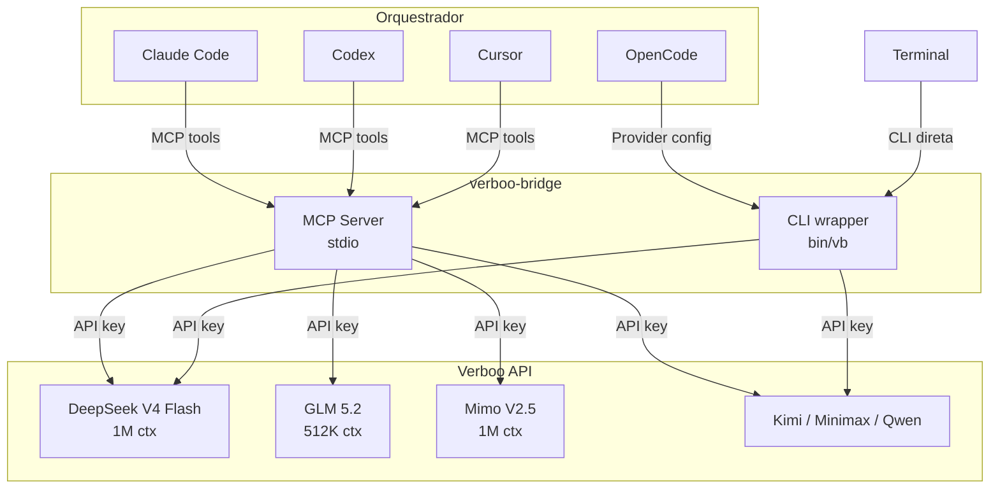
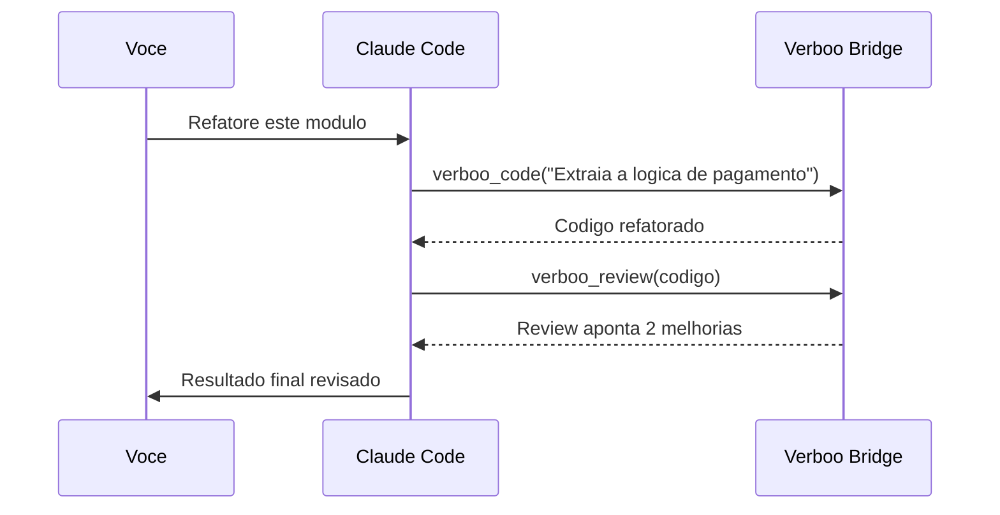

<p align="center">
  
  =18">
  
  
</p>

<div align="center">
  <h1>verboo-bridge</h1>
  <p><strong>Use modelos da Verboo como sub-agentes no Claude Code, Codex, OpenCode, Cursor ou qualquer cliente MCP</strong></p>
  <p>Transforme tokens ilimitados da Verboo em execucao distribuida para seu orquestrador preferido</p>
</div>

---

## Arquitetura



---

## Modelos disponiveis

| Modelo | Contexto | Tier | SWE-bench Pro | Terminal-Bench | WebDev Arena | Ideal para |
|--------|----------|------|:-:|:-:|:-:|-----------|
| **DeepSeek V4 Flash** | 1.048.576 | Pro | 82-89% | 56.9 | - | Codificacao geral, **melhor CxB** |
| **GLM 5.2** | 524.288 | Ultra | 62.1% | 81.0 | #2 (1.593 Elo) | Raciocinio complexo |
| **Mimo V2.5** | 1.048.576 | Pro | - | - | - | Analise pesada |
| **Kimi K2.7** | 262.144 | Pro | ~60% | - | - | Tarefas gerais |
| **Minimax M3** | 1.048.576 | Pro | - | - | - | Codificacao |
| **GLM 4.7 Flash** | 200.704 | Pro | - | - | - | Tarefas rapidas |
| **Qwen 3.6 27B** | 262.144 | Pro | - | - | - | Tarefas leves |

---

## Instalacao rapida

```bash
git clone https://github.com/nikolasdehor/verboo-bridge.git
cd verboo-bridge
npm install
```

### Variavel de ambiente

```bash
export VERBOO_API_KEY="sua_chave_aqui"
```

> Se usa Claude Code, pode colocar no `~/.config/claude-secrets.env`:
> ```bash
> export VERBOO_API_KEY="vbk_..."
> ```

---

## Configuracao por plataforma

### Claude Code

Adicione no `~/.claude.json`:

```json
{
  "mcpServers": {
    "verboo-bridge": {
      "command": "node",
      "args": ["/caminho/para/verboo-bridge/index.mjs"],
      "env": {
        "VERBOO_API_KEY": "${VERBOO_API_KEY}"
      }
    }
  }
}
```

O `${VERBOO_API_KEY}` sera resolvido automaticamente pelo Claude Code a partir do environment.

### OpenCode

**Opcao 1 — MCP server** (tools via Claude):

```json
{
  "mcpServers": {
    "verboo-bridge": {
      "command": "node",
      "args": ["/caminho/para/verboo-bridge/index.mjs"],
      "env": {
        "VERBOO_API_KEY": "{env:VERBOO_API_KEY}"
      }
    }
  }
}
```

**Opcao 2 — Provider direto** (ja configurado, use `opencode -m verboo:deepseek-v4-flash`):

```json
{
  "provider": {
    "verboo": {
      "name": "Verboo",
      "npm": "@ai-sdk/openai-compatible",
      "options": {
        "baseURL": "https://code.verboo.ai/router/v1",
        "apiKey": "{env:VERBOO_API_KEY}"
      },
      "models": {
        "deepseek-v4-flash": { "name": "DeepSeek V4 Flash", "limit": { "context": 1048576, "output": 65536 } },
        "glm-5.2":           { "name": "GLM 5.2",           "limit": { "context": 524288,  "output": 65536 } },
        "mimo-v2.5":         { "name": "Mimo V2.5",         "limit": { "context": 1048576, "output": 65536 } },
        "kimi-k2.7":         { "name": "Kimi K2.7",         "limit": { "context": 262144,  "output": 65536 } },
        "minimax-m3":        { "name": "Minimax M3",        "limit": { "context": 1048576, "output": 65536 } },
        "glm-4.7-flash":     { "name": "GLM 4.7 Flash",    "limit": { "context": 200704,  "output": 65536 } },
        "qwen3.6-27b":       { "name": "Qwen 3.6 27B",     "limit": { "context": 262144,  "output": 65536 } }
      }
    }
  }
}
```

### Codex

Adicione no `~/.codex/config.json`:

```json
{
  "mcpServers": {
    "verboo-bridge": {
      "command": "node",
      "args": ["/caminho/para/verboo-bridge/index.mjs"],
      "env": {
        "VERBOO_API_KEY": "${VERBOO_API_KEY}"
      }
    }
  }
}
```

### Cursor

Adicione no `.cursor/mcp.json` do projeto:

```json
{
  "mcpServers": {
    "verboo-bridge": {
      "command": "node",
      "args": ["/caminho/para/verboo-bridge/index.mjs"],
      "env": {
        "VERBOO_API_KEY": "${VERBOO_API_KEY}"
      }
    }
  }
}
```

---

## Uso

### Via MCP (Claude/Codex/Cursor)

Quando o MCP server estiver registrado, o orquestrador tera acesso a estas tools:

| Tool | Descricao |
|------|-----------|
| `verboo_code` | Codificacao com DeepSeek V4 Flash |
| `verboo_review` | Code review |
| `verboo_deepseek_v4_flash` | Modelo especifico |
| `verboo_glm_5_2` | Modelo especifico |
| `verboo_mimo_v2_5` | Modelo especifico |
| `verboo_kimi_k2_7` | Modelo especifico |
| `verboo_minimax_m3` | Modelo especifico |
| `verboo_glm_4_7_flash` | Modelo especifico |
| `verboo_qwen3_6_27b` | Modelo especifico |

Exemplo de prompt para o Claude:

> _"Use a tool verboo_code para gerar os testes deste modulo, e verboo_review para revisar o codigo atual."_

### Via CLI direta

```bash
# Prompt simples
vb "Explique closures em JavaScript"

# Com modelo especifico e system prompt
vb -m glm-5.2 -s "Seja conciso e tecnico" "Analise a complexidade deste algoritmo"

# Pipe de arquivo
cat main.py | vb -m mimo-v2.5 "Revise este codigo"

# Streaming (veja os tokens em tempo real)
vb --stream "Escreva um CRUD em Node.js"

# Listar modelos
vb --list
```

### Via OpenCode (provider direto)

```bash
opencode -m verboo:deepseek-v4-flash "Refatore este componente"
opencode -m verboo:glm-5.2 "Resolva este problema complexo"
```

---

## Skill para Claude

Para ensinar o Claude a delegar automaticamente tarefas de volume para a Verboo, copie o skill file:

```bash
cp -r skills/verboo-executor ~/.claude/skills/
```

O skill ensina o padrao de delegacao:

1. Claude recebe a tarefa
2. Claude separa em **orquestracao** (fica com Claude) + **volume** (delega pra Verboo)
3. Claude chama `verboo_code` ou `verboo_review` com instrucoes claras
4. Claude integra e valida o resultado

---

## Planos Verboo

| Plano | Preco | Tokens | Conexoes | Modelos |
|-------|-------|--------|----------|---------|
| Junior | R$ 75/mes | Ilimitado | 2 | Modelos basicos |
| **Pro** | **R$ 174/mes** | **Ilimitado** | **4** | **deepseek-v4-flash, mimo-v2.5 (1M ctx)** |
| Ultra | R$ 900/mes | Ilimitado | 2 | + GLM 5.2, todos |

> **Recomendacao:** Pro (R$ 174/mes) — 4 conexoes concorrentes, 1M de contexto, tokens ilimitados.
> Unico plano com 4 conexoes simultaneas (Ultra tem apenas 2).

---

## Exemplos reais

### Code review em lote

```bash
# Revisar varios arquivos de uma vez com Verboo
for f in src/**/*.ts; do
  cat "$f" | vb -m mimo-v2.5 -s "Revise este arquivo TypeScript" > "reviews/$(basename $f).review.md"
done
```

### Refatoracao assistida



### Geracao de testes

> "Claude, use o `verboo_code` para gerar testes unitarios para cada funcao neste modulo. Depois execute e me diga se passam."

---

## Recursos do MCP server

O server tambem expoe **resources** e **prompts**:

| Tipo | URI | Descricao |
|------|-----|-----------|
| Resource | `verboo://models` | Lista de modelos com specs |
| Resource | `verboo://status` | Status da conexao |
| Prompt | `revisar-codigo` | Template de code review |
| Prompt | `refatorar` | Template de refatoracao |
| Prompt | `explicar` | Template de explicacao |

---

## Variaveis de ambiente

| Variavel | Default | Descricao |
|----------|---------|-----------|
| `VERBOO_API_KEY` | — | **Obrigatoria.** Chave da API Verboo |
| `VERBOO_BASE_URL` | `https://code.verboo.ai/router/v1` | URL base da API |
| `VERBOO_LOG_LEVEL` | `info` | Nivel de log: `debug`, `info`, `warn`, `error` |

---

## Desenvolvimento

```bash
git clone https://github.com/nikolasdehor/verboo-bridge.git
cd verboo-bridge
npm install
VERBOO_API_KEY="vbk_..." node index.mjs
```

Testar o MCP server:

```bash
# Inicializar e listar tools
echo '{"jsonrpc":"2.0","id":1,"method":"initialize","params":{"protocolVersion":"2024-11-05","capabilities":{},"clientInfo":{"name":"test","version":"1.0"}}}' | node index.mjs
```

---

## Licenca

MIT — use, modifique, compartilhe.
